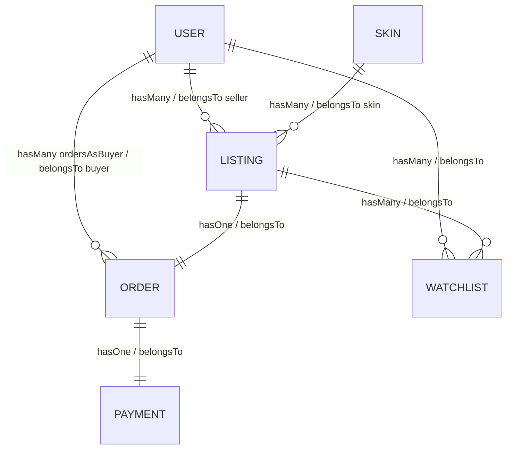

# SkinEmporium - App Description + ERD

## 1) What my application is
SkinEmporium is a basic website inspired by CSFloat where people can buy and sell Counter-Strike skins.

Main idea is not making a super advanced platform yet. I want to build the core parts first so it is easy to understand and easy to improve later.

What it will do:
- Let users make accounts and log in
- Let users post skin listings with simple info (name, float, condition, price)
- Let other users browse listings and open details
- Let buyers purchase available listings
- Let sellers see their own listings and sold history

Audience:
- CS players who want to trade skins in a simple way
- Beginner web-dev learners (including me) who want to practice a real project with clean structure

---

## 2) ERD (models, main properties, relations)

### Models + main properties

#### User
- id
- username
- email
- password
- steam_trade_url
- wallet_balance
- created_at

#### Skin
- id
- weapon_name
- skin_name
- rarity
- image_url
- created_at

#### Listing
- id
- seller_id (FK -> User)
- skin_id (FK -> Skin)
- condition
- float_value
- price_usd
- status (active/sold/cancelled)
- created_at

#### Order
- id
- buyer_id (FK -> User)
- listing_id (FK -> Listing)
- total_price_usd
- order_status (pending/paid/completed/refunded)
- created_at

#### Payment
- id
- order_id (FK -> Order)
- provider
- transaction_ref
- amount_usd
- payment_status
- paid_at

#### Watchlist
- id
- user_id (FK -> User)
- listing_id (FK -> Listing)
- created_at

---

### Relations (with type + names in both directions)

1. User 1-N Listing
- Type: 1-N
- User -> Listing: `user hasMany listings`
- Listing -> User: `listing belongsTo seller`

2. Skin 1-N Listing
- Type: 1-N
- Skin -> Listing: `skin hasMany listings`
- Listing -> Skin: `listing belongsTo skin`

3. User 1-N Order
- Type: 1-N
- User -> Order: `user hasMany ordersAsBuyer`
- Order -> User: `order belongsTo buyer`

4. Listing 1-1 Order
- Type: 1-1
- Listing -> Order: `listing hasOne order`
- Order -> Listing: `order belongsTo listing`

5. Order 1-1 Payment
- Type: 1-1
- Order -> Payment: `order hasOne payment`
- Payment -> Order: `payment belongsTo order`

6. User N-M Listing (through Watchlist)
- Type: N-M
- User -> Listing: `user belongsToMany watchlistedListings`
- Listing -> User: `listing belongsToMany watchers`
- Pivot model/table: `watchlists`

---

## 3) Quick ERD view (text)

```text
User (1) ----< (N) Listing >---- (1) Skin
  |                      |
  |                      | (1)
  |                      v
  |                    Order (1) ---- (1) Payment
  |
  |\
  | \ (N-M via Watchlist)
  |  \
  v   v
Listing
```


