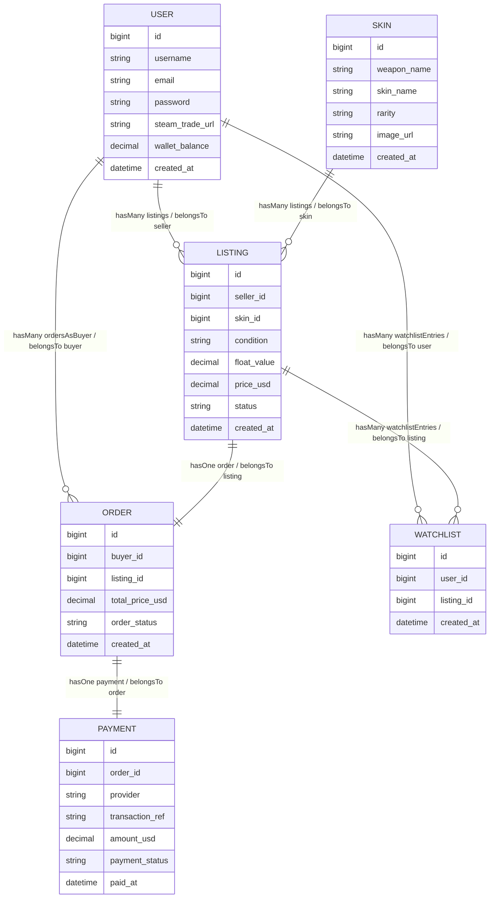

# SkinEmporium ERD Diagram

```mermaid
erDiagram
    USER {
        bigint id
        string username
        string email
        string password
        string steam_trade_url
        decimal wallet_balance
        datetime created_at
    }

    SKIN {
        bigint id
        string weapon_name
        string skin_name
        string rarity
        string image_url
        datetime created_at
    }

    LISTING {
        bigint id
        bigint seller_id
        bigint skin_id
        string condition
        decimal float_value
        decimal price_usd
        string status
        datetime created_at
    }

    ORDER {
        bigint id
        bigint buyer_id
        bigint listing_id
        decimal total_price_usd
        string order_status
        datetime created_at
    }

    PAYMENT {
        bigint id
        bigint order_id
        string provider
        string transaction_ref
        decimal amount_usd
        string payment_status
        datetime paid_at
    }

    WATCHLIST {
        bigint id
        bigint user_id
        bigint listing_id
        datetime created_at
    }

    USER ||--o{ LISTING : "hasMany listings / belongsTo seller"
    SKIN ||--o{ LISTING : "hasMany listings / belongsTo skin"
    USER ||--o{ ORDER : "hasMany ordersAsBuyer / belongsTo buyer"
    LISTING ||--|| ORDER : "hasOne order / belongsTo listing"
    ORDER ||--|| PAYMENT : "hasOne payment / belongsTo order"
    USER ||--o{ WATCHLIST : "hasMany watchlistEntries / belongsTo user"
    LISTING ||--o{ WATCHLIST : "hasMany watchlistEntries / belongsTo listing"
```
